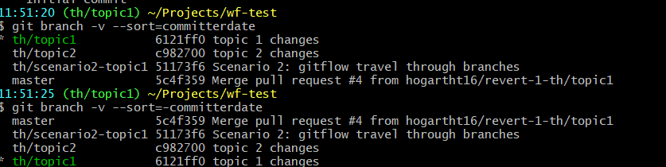

# Git Tips Archive

Taken from emails sent by team members

- [Git Alias](#git-alias)
- [Cherry Pick & Stash](#cherry-pick--stash)
- [Checkout previous](#checkout-previous)
- [Sorting branches](#sorting-branches)
- [Save before Stash](#save-before-stash)
- [Windows file lock mess](#windows-file-lock-mess)
- [Checkout files from other commits](#checkout-files-from-other-commits)
- [Git config](#git-config)

## Git Alias

Create an alias to show the last commit in the current branch.

`git config --global alias.last "log -1 --stat"`

## Cherry Pick & Stash

Today I was working on the search directives but I took a break to add font-awesome to the project. I did this on the same branch where I have my unfinished search stuff. Since I wanted to make this available to everyone sooner rather than later, I knew I had to create a pull request from a clean branch derived from master.  Because I had a lot of uncommitted work that I did not want to lose in addition to the font-awesome stuff, I had to deal with it before switching branches.

1.  Commit the font-awesome related changes. Record the commit ID “c7f43dc0”
    1.  `git add package.json index.html yarn.lock gulpfile.js`
    1.  `git commit -m "added font awesome"`
1.  Stash the other changes (tracked files only)
    1.  `git stash`
1.  Create a new branch from master
    1.  `git branch fa-stuff master`
1.  Checkout the new branch
    1.  `git checkout fa-stuff`
1.  Snag the font-awesome changes from the commit made in step \#1.
    1.  `git cherry-pick c7f43dc0`
1.  Reset the commit but retain the changes (`--soft` retains the changes as staged, `--mixed` retains the changes as unstaged, which is the default if not specified)
    1.  `git reset HEAD~1`
1.  Edit the _index.html_ file to remove any of the search stuff committed earlier.
1.  Re-commit the changes
    1.  `git add .`
    1.  `git commit -m "added font awesome 4.1" -m "FA < v4 wont install via npm due to missing dependencies"`
1.  Push to origin (my master and hence this branch was already in sync with upstream/master)
    1.  `git push -u origin fa-stuff`
1.  Create pull request
1.  Checkout the branch where I was working on the search stuff
    1.  `git checkout work`
1.  Get my work back.
    1.  `git stash pop`

## Checkout previous

Can quickly switch back to the last branch you had checked out with: `git checkout -`

## Sorting branches

This happens to me a lot. I switch branches to test something, perhaps a code review, or someone is in my cube, or its Monday and I don’t have good notes. Anyway, I’ve forgotten which branch I was working in.

List branch, last commit (head), and sort by the commit date. Precede the `commiterdate` with a dash to sort in descending order

Other sort keys include : objectsize, authordate, committerdate, creatordate, taggerdate

Sources:
*   [StackOverflow](https://stackoverflow.com/questions/5188320/how-can-i-get-a-list-of-git-branches-ordered-by-most-recent-commit#5188364)
*   `git help ref-for-each`

## Save before Stash

If you are going to use git stash, make sure that you have save the files open in your editor first. I just lost hours of work by not saving.

## Windows file lock mess

1.  `git checkout master`. There are no pending changes because I do not code on master.
1.  `git checkout <another branch>`, I get an error because Windows has locked a file and git is unable to replace it
1.  I close Atom, and try again, now I get error that local changes will be over-ridden.
1.  My master branch is now full of changes which git dumped in there when it could not switch to <another branch>

What to do?

1.  `git reset –hard`, removes staged and working directory changes (when no commit is specified, git assumes you mean HEAD)
1.  `git clean -fd`, removes untracked  (`-f` = force;` -d` = both files and directories.)

## Checkout files from other commits

As I get close to finishing the portal search, I realized that the resulting pull request is going to be unwieldy. Thus today I decided to move changes I made to the `appListManger` into its own PR.  But how to do this without including the other changes which are not ready for a PR? Sure I could have copied the `appListManager` files outside of the local repo and then created a new branch from master and then copied the files into the new branch. But that’s just annoying.

1.  Checkout master.
2.  `git pull` to ensure it is up to date
3.  Create a new branch from master `git checkout -b <name of branch>`.
4.  Checkout the files needed from the commit of interest. Since git is storing a snapshot of the project with each commit, I really only need to select the last commit or the name of the branch. `git checkout <name of branch with the changes>  file1 file2`
    1.  In this case, since I had moved the spec folder for `appListManager` into spec/unit/components but this had not been done in master, thus I first had to create the components folder.
    1.  Then I performed: `git checkout th/header-alt app/components/app-list-manager/* spec/unit/components/app-list/app-list.service.spec.js`

## Git config

I found it annoying that I had to include the remote and the branch name when I pushed a new branch to Github. Found out that this is the default to prevent newbies from breaking stuff. However, for the more adventurous there are 5 other options. I have set mine to automatically push to origin and to create a branch matching the current branch if it does not exist unless the tracking branch has already been defined otherwise.

`git config –global push.default current`

thus I can now specify `git push` instead of `git push origin my-long-annoying-branch-name`

Some other tweaks I’ve made recently are:

*   `git config –global status.showUntrackedFiles all`
    *   This one will show the untracked files and not just the folder they are found in when git status is executed.
*   `git config –global status.showStash true`
    *   This will show how many stash entries I have. Helps me to remember that I might have something important in there
*   `git config –global status.displayCommentPrefix true`
    *   Inserts a hash before each status output line. Mostly.
*   `git config –global fetch.prune true`
    *   Removes all stale remote-tracking branches (during a fetch) which have already been removed from the remote repository, but are still locally available in "remotes/"

Some of these are already documented in the dev guide’s [git-help](./git-help.md).
