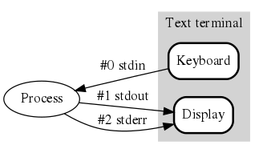

# Terminals

Those windows in which we type commands on a command line are called terminals.

* [Terminal Emulators](#terminal-emulators)
  * [Terminal Applications](#terminal-applications)
    * [ConEmu](#conemu)
    * [Others](#others)
* [Console Applications (Shells)](#console-applications-shells)

## Terminal Emulators

A hold-over from the main-frame time-sharing days of computers, a terminal was a dedicated workstation consisting mainly of a keyboard and CRT. Their role was confined to the display and input of data. Early user terminals connected to computers were electromechanical teleprinters/teletypewriters (TTY). When video was introduced, each manufacturer had its own control (aka escape) sequences that the video terminal interpreted to display output. Slowly these consolidated into a handful such as VT-100, VT-200, VT-220, & XTERM.

A text terminal, or often just terminal (sometimes text console) is a serial computer interface for text entry and display. The fundamental type of application running on a text terminal is a command line interpreter or shell, which prompts for commands from the user and executes each command after a press of Enter. This includes Unix shells and some interactive programming environments. In a shell, most of the commands are small applications themselves.

A terminal emulator is a piece of software that emulates a text terminal. The Win32 console on Windows does not emulate a physical terminal that supports escape sequences so SSH and Telnet programs (for logging in textually to remote computers) for Windows, including the Telnet program bundled with some versions of Windows, often incorporate their own code to process escape sequences.

The terminal emulators on most Unix-like systems, such as, for example, gnome-terminal, qterminal, xterm, terminal.app, do emulate physical terminals including support for escape sequences; e.g. xterm can emulate the VT220 and Tektronix 4010 hardware terminals.

### Terminal Applications

#### ConEmu

[ConEmu](https://conemu.github.io/), alternative for MS-Windows.

#### Others

*   [Win32 console](https://www.computerhope.com/issues/chusedos.htm), standard on MS-Windows.
*   [Terminal](http://blog.teamtreehouse.com/introduction-to-the-mac-os-x-command-line), standard on OSX.
*   [Others](https://en.wikipedia.org/wiki/List_of_terminal_emulators)

## Console Applications (Shells)

When a user starts a terminal, it runs some console application, typically a command line interpreter (aka shell).

Popular Shells

*   [Bash](../bash-help.md)
*   [PowerShell](./powershell.md)
*   [Zsh](http://zsh.sourceforge.net/Doc/Release/zsh_toc.html)
*   [Interactive Python (ipython)](https://www.python.org/shell/)
*   [Interactive Ruby (irb)](https://en.wikipedia.org/wiki/Interactive_Ruby_Shell)
*   [Interactive Nodejs](https://scriptverse.academy/tutorials/js-nodejs-shell.html)

Popular Apps

*   [Git](https://git-scm.com/)
*   [GNU Utilities](https://www.gnu.org/software/coreutils/manual/html_node/index.html) (grep, awk, sed, test)
*   [Vim](https://www.vim.org/), the ubiquitous text editor
*   [curl](https://curl.haxx.se/), tool and library
for transferring data with URLs
*   [more...](https://stackify.com/top-command-line-tools/)
